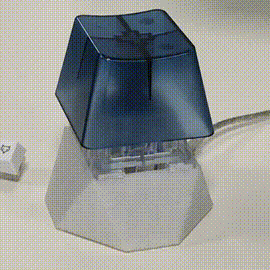

# System Monitor Lamp
A single-key USB keyboard-lamp that lights up according to the CPU, network and disk usages of the host.

Each metric is displayed as one color channel; green for CPU, blue for network and red for disk.
The LEDs on the ring are split according to the number of CPU cores for the green channel.
For disk and network the ring is split in two, left for input and right for output.

The lamp also functions as a USB keyboard. The Big Switch can be configured to report a key
to be bound as a global shortcut and perform tasks on the host's operating system. I use it
to lock the computer when I want to get a coffee, but lately I'm considering binding it to `killall -9 java`...

## How it works
The Teensy firmware has support for [Raw HID](https://www.pjrc.com/teensy/rawhid.html), which can be used to
send arbitrary data from the host to the device where it can be interpretted as we wish to operate
digital or analog pins.

This project contains both code for the lamp and a service to run on the host computer. The host collects
system monitoring metrics every 2 seconds and sends them over USB to the lamp by encoding the luminosity
of each color channel. The lamp then interpolates received values with the previous ones and animates the
transition over the next 2 seconds.

The lamp's code is in C++ and the host's service code is in Rust.

## Hardware

- [Tennsy 2.0](https://www.pjrc.com/store/teensy.html)
- [NovelKeys Big Switch](https://novelkeys.xyz/products/the-big-switch-series)
- [NeoPixel Ring 24x or 12x](https://www.adafruit.com/product/1586)
- [A 3D-printed case](https://www.thingiverse.com/thing:3305532) (I got mine printed through http://3dhubs.com/)

Connect the Big Switch to GND and pin 0 and the NeoPixel's Data Input to pin 23
(along with PWR and GND to their respective pin) on the Teensy 2.0.
This can also be changed by editing [lamp.ino](lamp/lamp.ino).

## Platform support

- The host system monitor service currently only fully works on Linux.
- CPU reporting is working on macOS without network and disk.
  The host sometimes has difficulties communicating with the lamp for some reason that I didn't investigate.
- Windows support isn't implemented.

I used [Teensyduino](https://www.pjrc.com/teensy/teensyduino.html) 1.44 for the USB lamp.
I have not tested newer versions but as long as the linker is happy about the usb object files of this project
trying to override the ones from the Teensyduino library, it should be fine.

The lamp code will probably only work on a Teensy 2.0 and not any other version as I had to make a copy of their ATMEGA32U4
USB code to allow both RawHID and keyboard interfaces together, as well as tweak the `bMaxPower` constant and enable
remote wake-up of the host when the key is pressed. Using ARM Teensy variants would require doing the same on a copy of their USB code.
